#  Abstract

Heart disease remains one of the leading causes of death worldwide, making early detection a critical public health objective. In this project, we leverage supervised machine learning techniques—**Logistic Regression**, **Decision Tree**, **Random Forest**, and **XGBoost**—to predict heart disease risk using the **2015 Behavioral Risk Factor Surveillance System (BRFSS)** dataset. The dataset captures a comprehensive range of health, lifestyle, and demographic factors, including **blood pressure status, cholesterol levels, physical activity, smoking habits, age, gender, income,** and **education level**.

Through systematic model development, hyperparameter tuning, and class imbalance handling via **SMOTE**, we find that **XGBoost** achieved the highest overall performance, attaining an **accuracy of 85%** and a strong balance between precision and recall for minority class prediction. Feature importance analysis highlights **age**, **general health status**, **high blood pressure**, and **income level** as the most influential predictors of heart disease.

This work demonstrates the potential of machine learning models as effective, interpretable tools for **early risk identification** and **preventive healthcare initiatives**. Future extensions of this study could involve developing ensemble meta-models, implementing cost-sensitive algorithms, and integrating real-time clinical data for dynamic risk assessment.


# BRFSS 2015 Heart Disease Dataset

##  Dataset Overview
- **Source**: [BRFSS 2015 Dataset on Kaggle](https://www.kaggle.com/)
- **Size**: 253,680 samples
- **Features**: 22 columns
- **Target Variable**: 
  - `HeartDiseaseorAttack` (Binary classification)
    - `0` = No (No history of heart disease or attack)
    - `1` = Yes (Diagnosed with heart disease or heart attack)

##  Attributes (Features)
This dataset includes over 20 behavioral, clinical, and socio-demographic features:
- **Health and Behavioral Factors**:
  - `HighBP`: High blood pressure
  - `HighChol`: High cholesterol
  - `Smoker`: Smoking history
  - `Stroke`: History of stroke
  - `Diabetes`: Diabetes diagnosis
  - `PhysHlth`: Physical health (days unwell)
  - `MentHlth`: Mental health (days unwell)

- **Demographic Factors**:
  - `BMI`: Body Mass Index
  - `Age`: Age group
  - `Sex`: Gender
  - `Education`: Education level
  - `Income`: Income category

- **Varibles Description**:
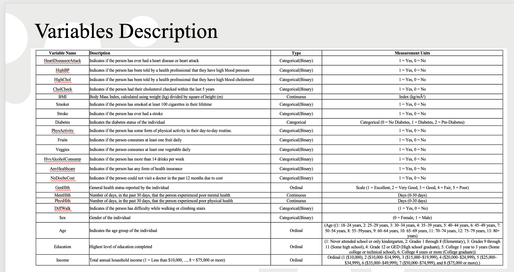

#  Data Cleaning : Heart Disease Dataset

## 1. Overview

To ensure high-quality input for modeling, a detailed data cleaning process was performed focusing on:

- Identifying and handling dirty string placeholders.
- Detecting and removing duplicate rows.

---

## 2. Handling Dirty String Values

Many real-world datasets contain invalid or inconsistent placeholders for missing values.  
To address this, the following dirty string values were considered:

> `'nan'`, `'null'`, `'na'`, `'missing'`, `'-'`, `'--'`, `'n/a'`

A case-insensitive pattern matching was applied to the entire dataset.

 **Result**:  
No dirty or invalid string placeholders were detected in any of the 22 columns.  
Thus, no replacements or imputations were necessary for this step.

---

## 3. Removing Duplicate Rows

Duplicate records can bias the analysis and modeling if left untreated.

- **Total duplicate rows found**: **23,899**
- **Original dataset shape**: **253,680 rows × 22 columns**
- **New dataset shape after removing duplicates**: **229,781 rows × 22 columns**

A sample inspection of the duplicates showed repeated identical entries across both behavioral and demographic features.

 **Action Taken**:  
All detected duplicate rows were removed to ensure data integrity.

---

## 4. Summary

| Step                          | Result                                       |
|--------------------------------|----------------------------------------------|
| Dirty String Values Found     | None detected                                |
| Total Duplicate Rows          | 23,899                                       |
| Original Dataset Shape        | (253,680 rows, 22 columns)                   |
| Cleaned Dataset Shape         | (229,781 rows, 22 columns)                   |

---


##  Insights Derived from Visualizations
###  Overall Trends: Uncovering Patterns in Heart Health


This analysis uncovers more than just numeric trends—it tells a nuanced story about **public health disparities**, **preventive efforts**, and the **societal context** of cardiovascular risk.

###  Social Inequality in Risk Factors
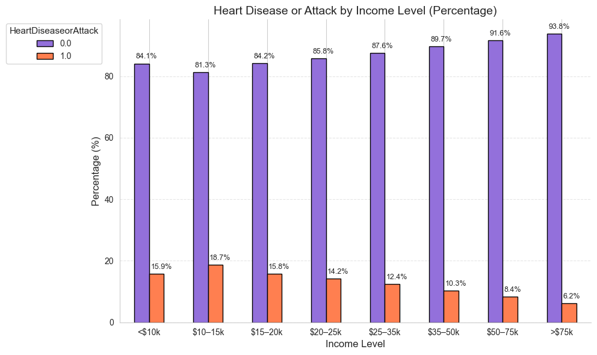
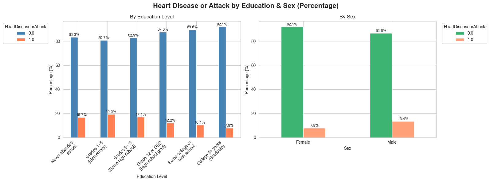

- **Low-income individuals** (especially those earning < $20K) and those with **less than high school education** exhibit significantly **higher prevalence of heart disease**, ranging from **15% to 19%**.
- In contrast, people earning **>$75K/year** and with a **college degree** show prevalence as low as **6.2% and 7.9%**, respectively.
- **Men** show **13.4%** prevalence vs. **7.9%** in **women**, indicating that gender plays a crucial role.

> These results emphasize that **socioeconomic and educational disparities are directly linked to cardiovascular health outcomes.**

###  Prevention Gaps in Lifestyle & Access
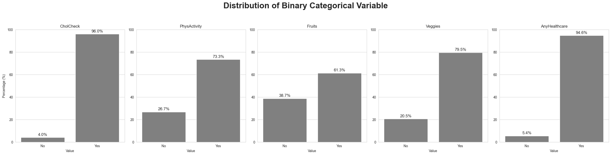

- **96% have checked their cholesterol** (CholCheck) and **94.6% have healthcare access**, indicating strong system reach.
- Yet, **cost barriers** (NoDocbcCost: 9.3%) and **mobility issues** (DiffWalk: 18.6%) highlight underlying systemic strain.
- **73.3% report physical activity** and a majority eat **fruits (61.3%)** and **vegetables (79.5%)**, but a non-trivial population still lacks healthy lifestyle adherence.

> These preventive insights suggest success in outreach but persistent gaps in behavioral health maintenance.

###  Risk Distribution in Binary Variables
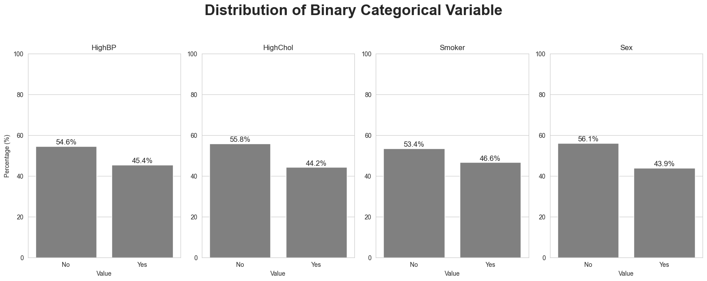
- Conditions like **HighBP (45.4%)**, **HighChol (44.2%)**, and **Smoking (46.6%)** show near-even splits in the population.
- **Sex distribution** also show near-even splits in the population. 56.1% are Female and 43.9% Male.
- This balance creates a tipping point: a shift in behavior or environment could heavily impact community health trends.

> These distributions serve as an early warning system, showing how easily health patterns can shift in a population when risk factors are widespread but not yet dominant.


### Ordinal Variable Trends
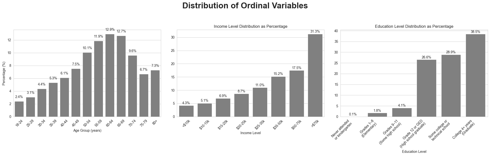
- **Age** peaks in the 55–69 range, matching common heart disease risk windows.
- **Income** is heavily skewed, with **31.3% earning > $75K**, but over **35% earning < $35K**.
- **Education level is positively skewed**:
  - The majority have **some college or above**, with **38.5% having a college degree**.
  - Lower education groups (e.g., no diploma) show **notably higher rates of heart disease** in other analysis plots.


> These ordinal distributions provide context for chronic disease risk and social determinants of health.

###  Continuous Variable Insights
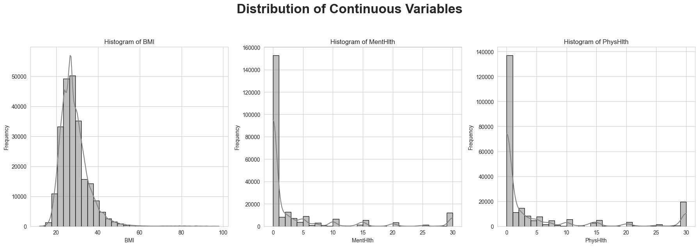
- **BMI** shows a right-skewed bell curve, peaking between 25–30—placing most people in the overweight bracket.
- **Mental Health (MentHlth)** and **Physical Health (PhysHlth)** show extreme right skew: many report 0 days of poor health, but a sizable spike at 30 days indicates long-term issues.
- **Physical Health (PhysHlth)**: A similar pattern to MentHlth, with most respondents reporting excellent health but a significant minority enduring chronic physical conditions (30+ days of issues).
> These distributions reflect a polarized population: many are healthy, but a large subset suffers chronic conditions.

###  Target Variable Imbalance
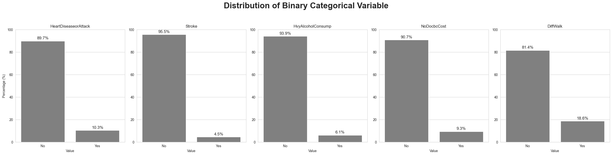

###  Key Insight:
The dataset highlights a strong **class imbalance** in several key health indicators:

- **HeartDiseaseorAttack**: Only **10.3%** of the population reported having experienced heart disease or a heart attack.
- **Stroke**: Just **4.5%** reported ever having a stroke.
- **Heavy Alcohol Consumption**: Reported by **6.1%**.
- **NoDoctorDueToCost**: **9.3%** avoided healthcare due to affordability.
- **Difficulty Walking**: Affects **18.6%**, suggesting some functional limitation.

---

While most individuals appear healthy in this dataset, a deeper dive reveals a **critical imbalance**—not just in counts, but in consequences.

These low-frequency responses represent the **most vulnerable segments**—those who may not be "numerically dominant" but are **clinically significant**. And yet, they are the ones most likely to be misclassified or under-prioritized by conventional machine learning models.

---
#  Correlation Matrix Analysis: Heart Disease Dataset

This section describes the analysis of feature correlations within the BRFSS 2015 Heart Disease dataset.

---
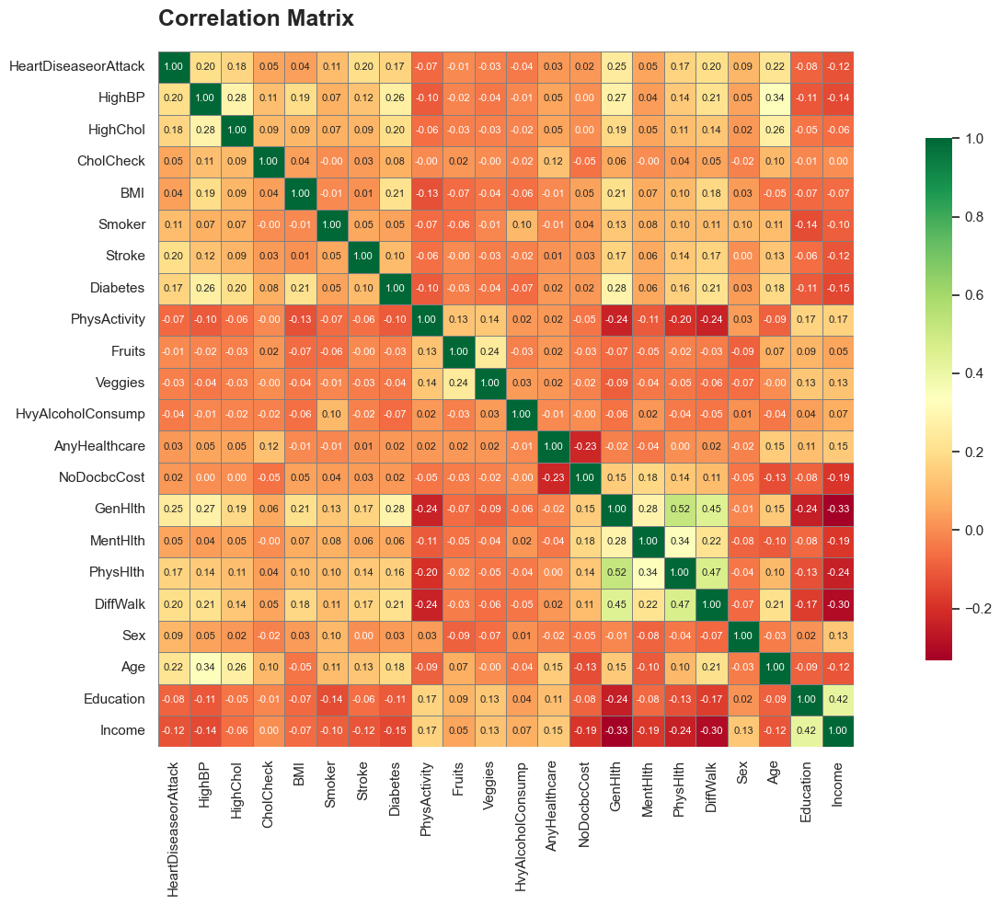
##  Purpose of Correlation Matrix
The correlation matrix helps identify:

- **Relationships between features** (positive or negative)
- **Strength of associations** (how strongly features are related)
- **Potential multicollinearity** (highly correlated predictors, which can affect modeling)
- **Key drivers** related to the target variable (`HeartDiseaseorAttack`)

#  Correlation Matrix: Key Results

##  Top Correlations with Target (`HeartDiseaseorAttack`)

| Feature                         | Correlation Coefficient |
|----------------------------------|--------------------------|
| DiffWalk (Difficulty Walking)    | **0.30**                 |
| GenHlth (General Health)          | **0.25**                 |
| Age                              | **0.22**                 |
| HighBP (High Blood Pressure)     | 0.18                     |
| HighChol (High Cholesterol)      | 0.18                     |
| PhysHlth (Physical Health)       | 0.17                     |
| Diabetes                         | 0.17                     |
| MentHlth (Mental Health)         | 0.11                     |
| Stroke                           | 0.10                     |
| CholCheck (Cholesterol Check)    | 0.11                     |

---

##  Other Strong Feature-Feature Correlations

| Feature Pair                     | Correlation |
|-----------------------------------|-------------|
| GenHlth & PhysHlth                | 0.52        |
| GenHlth & MentHlth                | 0.45        |
| PhysHlth & MentHlth               | 0.34        |
| Age & Income                      | 0.42        |

---

##  Key Observations

- **Difficulty Walking** had the highest positive correlation with heart disease.
- **General Health** and **Age** are also important health risk indicators.
- **High Blood Pressure** and **High Cholesterol** are moderately associated with heart disease.
- No multicollinearity issues detected (no correlations above 0.7 or below -0.7 between independent features).

---

## Key Insights

The correlation analysis highlighted mobility limitations, self-perceived health, clinical measures, and aging as important factors for heart disease risk prediction.  
The dataset is ready for safe feature engineering and predictive modeling without heavy concern for multicollinearity.

---

#  Logistic Regression Modeling: Heart Disease Prediction


##  Objective

The goal is to develop a baseline predictive model to assess heart disease risk using behavioral, clinical, and socio-demographic factors from the **2015 Behavioral Risk Factor Surveillance System (BRFSS)** dataset.

---

##  Modeling Setup

After dataset cleaning and exploration, a **Logistic Regression** model was constructed with the following approach:

- **Dataset**: Cleaned BRFSS 2015 Heart Disease dataset (duplicates removed).
- **Feature Matrix (`X`)**: All features excluding the target variable (`HeartDiseaseorAttack`).
- **Target Variable (`y`)**: 
  - Binary encoding: 0 = No Heart Disease, 1 = Heart Disease.

- **Train-Test Split**:
  - 70% training set
  - 30% testing set
  - **Stratified split** to maintain the original class proportions.

- **Pipeline Components**:
  - **Scaler**: Applied `StandardScaler` to standardize continuous and ordinal features.
  - **Classifier**: Logistic Regression (`max_iter=1000`, `random_state=42`).

---

##  Methodology

| Step | Description |
|:-----|:------------|
| 1. Data Preparation | Cleaned the dataset, removed duplicates |
| 2. Feature Selection | Used all predictors except the target variable |
| 3. Preprocessing | Scaled continuous/ordinal features using StandardScaler |
| 4. Model Building | Fitted a Logistic Regression model with increased iterations |
| 5. Model Evaluation | Assessed performance using Precision, Recall, F1-Score, and Accuracy |

---

##  Evaluation Metrics

The Logistic Regression model was evaluated on the test set using:

- **Precision**
- **Recall**
- **F1-Score**
- **Support** (sample count per class)

The model serves as a **baseline** for comparison against more complex models like **Decision Tree**, **Random Forest**, and **XGBoost** in later stages of the project.

---


##  Model Evaluation Results

| Class                  | Precision | Recall | F1-Score | Support |
|-------------------------|:---------:|:------:|:--------:|:-------:|
| 0.0 (No Heart Disease)   | 0.91      | 0.99   | 0.95     | 61,820  |
| 1.0 (Heart Disease)      | 0.54      | 0.12   | 0.20     | 7,115   |
| Macro Average            | 0.72      | 0.56   | 0.57     | 68,935  |
| Weighted Average         | 0.87      | 0.90   | 0.87     | 68,935  |

---

## Key Insights

- The model achieved a **high precision (91%) and recall (99%)** for identifying individuals without heart disease.
- For heart disease cases (Class 1), the model shows:
  - **Moderate precision (54%)** but
  - **Very low recall (12%)**, meaning many heart disease cases were missed.
- The **macro average** recall and F1-score are relatively low, indicating an imbalance in the model's ability to correctly identify both classes.
- Overall **accuracy** was approximately **90%**, but accuracy alone can be misleading in imbalanced datasets.

---

##  Challenges Identified

- **Severe class imbalance**: Heart disease cases are underrepresented, making it harder for the model to learn to detect them.
- **Low recall for positive cases (heart disease)**: This is a critical issue for healthcare-related predictions where missing a positive case can have serious consequences.

---

#  Conclusion

While the initial logistic regression model provides a strong baseline with high overall accuracy, it struggles to correctly identify individuals with heart disease.  
Future efforts will focus on addressing class imbalance and improving recall, ensuring the model is both accurate and clinically meaningful.

---

#  Logistic Regression Model with SMOTE: Heart Disease Dataset

##  Overview

To improve detection of heart disease cases, a Logistic Regression model was built using:

- Feature scaling on continuous and ordinal variables
- Passing binary features untouched
- Applying **SMOTE (Synthetic Minority Oversampling Technique)** to balance the dataset during training

This approach aimed to address the class imbalance problem identified in the baseline model.

---

##  Preprocessing Strategy

- **Continuous Variables** (`scaled_features`):
  - BMI, Mental Health (MentHlth), Physical Health (PhysHlth)
- **Ordinal Variables** (scaled):
  - Age, Education, Income, General Health (GenHlth)
- **Binary Variables** (passed through without scaling):
  - All other features
  
- **SMOTE** was applied **only on the training set** inside the pipeline, preventing data leakage.

---

##  Model Evaluation Results

| Class                  | Precision | Recall | F1-Score | Support |
|-------------------------|:---------:|:------:|:--------:|:-------:|
| 0.0 (No Heart Disease)   | 0.97      | 0.74   | 0.84     | 61,820  |
| 1.0 (Heart Disease)      | 0.26      | 0.78   | 0.39     | 7,115   |
| Macro Average            | 0.61      | 0.76   | 0.61     | 68,935  |
| Weighted Average         | 0.89      | 0.74   | 0.79     | 68,935  |

---

##  Key Insights

- **Recall for Heart Disease (Class 1)** improved significantly from **12% (baseline)** to **78%** after using SMOTE.
- However, **precision for Heart Disease** dropped to 26%, meaning many false positives are now being predicted.
- **No Heart Disease (Class 0)** still maintains **high precision (97%)** but recall dropped slightly to 74%.
- **Macro average recall** increased, indicating overall better ability to detect both classes.

---

##  Challenges Observed

- **Trade-off between precision and recall**: SMOTE improves recall at the cost of precision, a known behavior in oversampling.
- **Higher false positives**: More patients may be flagged at risk, which is acceptable in some medical scenarios where missing a true positive is costly.

##  Key Observations

The application of SMOTE inside the training pipeline drastically improved the model's sensitivity (recall) toward heart disease cases.  
Although precision decreased, the trade-off leans towards safer medical practice, prioritizing **identifying more true heart disease cases** rather than minimizing false alarms.


---
#  Logistic Regression Model with SMOTE and Hyperparameter Tuning

##  Overview

Building upon the baseline models, a **Logistic Regression** pipeline was created, incorporating:

- **Preprocessing**: Scaling continuous and ordinal features while passing binary features as-is.
- **SMOTE**: Synthetic oversampling applied during training to address class imbalance.
- **Hyperparameter Optimization**: Grid Search over regularization type (`l1`, `l2`, `elasticnet`), solver (`liblinear`, `saga`), and regularization strength (`C`).


##  Overview

The Logistic Regression model was built with the following strategies:

- **Data Preprocessing**:
  - Scaling continuous and ordinal features.
  - Passing binary features without scaling.
- **Addressing Class Imbalance**:
  - Applied **SMOTE (Synthetic Minority Oversampling Technique)** only to training data.
- **Hyperparameter Tuning**:
  - Optimized penalty (`elasticnet`), solver (`saga`), regularization strength (`C=0.01`), and `l1_ratio=0.85` using **GridSearchCV**.

This model aims to balance sensitivity (recall) and precision in predicting heart disease cases.

---

##  Best Model Configuration

| Parameter         | Value        |
|-------------------|--------------|
| Penalty           | ElasticNet   |
| Solver            | SAGA         |
| Regularization (C)| 0.01          |
| l1_ratio          | 0.85          |
| SMOTE             | Applied during training |


---

##   Model Evaluation on Test Set

| Class                  | Precision | Recall | F1-Score | Support |
|-------------------------|:---------:|:------:|:--------:|:-------:|
| 0.0 (No Heart Disease)   | 0.97      | 0.74   | 0.84     | 61,820  |
| 1.0 (Heart Disease)      | 0.26      | 0.78   | 0.38     | 7,115   |
| Macro Average            | 0.61      | 0.76   | 0.61     | 68,935  |
| Weighted Average         | 0.89      | 0.74   | 0.79     | 68,935  |

- **Overall Accuracy**: **74%**

---

##  Confusion Matrix

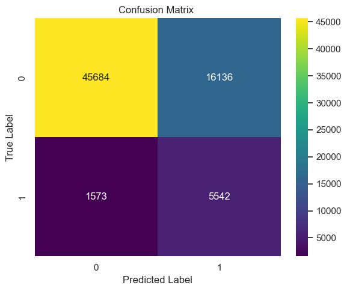

|                      | Predicted: No | Predicted: Yes |
|----------------------|:-------------:|:--------------:|
| **Actual: No Disease** | 45,684         | 16,136          |
| **Actual: Heart Disease** | 1,573         | 5,542           |

- **True Positives (Heart Disease correctly predicted)**: 5,542
- **False Negatives (Heart Disease missed)**: 1,573
- **False Positives (False alarms)**: 16,136

---

##  Key Insights

- **Recall for heart disease (78%)**: Greatly improved, meaning the model catches most positive cases.
- **Precision for heart disease (26%)**: Lower, leading to more false positives — acceptable in healthcare where missing a positive case is riskier.
- **Trade-off observed**: Model favors finding heart disease cases even at the cost of over-predicting them.
- **Overall**: Better clinical relevance compared to the original baseline model.

---


#  Heart Disease Classification using Decision Tree with SMOTE and GridSearchCV


##  Overview

This work builds a machine learning pipeline designed to classify heart disease cases by leveraging a **Decision Tree Classifier**, integrating hyperparameter optimization and techniques to address class imbalance.

Key steps:

- **Data Preprocessing**:
  - Scale continuous and ordinal features using `StandardScaler`.
  - Pass binary features without scaling.
- **Handling Class Imbalance**:
  - Apply **SMOTE (Synthetic Minority Oversampling Technique)** during training.
- **Hyperparameter Tuning**:
  - Perform **GridSearchCV** to optimize:
    - `max_depth`
    - `min_samples_split`
    - `min_samples_leaf`
    - `criterion`
- **Model Selection**:
  - Best parameters selected using **5-fold cross-validation** optimized for **F1 Score**.

---

##  Pipeline Components

- **Preprocessing**:
  - Scale numeric and ordinal variables.
  - Leave binary features unchanged.

- **SMOTE Oversampling**:
  - Synthetic sampling applied only to training data to balance class distribution.

- **Decision Tree Classifier**:
  - Tuned for best performance using:
    - `criterion`: ['gini', 'entropy']
    - `max_depth`: [5, 10, 15]
    - `min_samples_split`: [10, 20, 30]
    - `min_samples_leaf`: [1, 5, 10]

- **GridSearch Setup**:
  - **5-Fold Cross-Validation**.
  - Optimized using the **F1-Score** metric.

---

##  Best Model Configuration

| Hyperparameter          | Best Value |
|--------------------------|------------|
| Criterion                | Gini       |
| Max Depth                | 10         |
| Min Samples Split        | 20         |
| Min Samples Leaf         | 5          |
| SMOTE                    | Applied during training |


---

##  Model Evaluation on Test Set

| Metric                  | Class 0 (No Heart Disease) | Class 1 (Heart Disease) |
|--------------------------|----------------------------|-------------------------|
| Precision                | 0.94                       | 0.30                    |
| Recall                   | 0.86                       | 0.52                    |
| F1-Score                 | 0.90                       | 0.38                    |
| Support (Number of Samples) | 61,820                  | 7,115                   |

| Overall Metric           | Score |
|---------------------------|-------|
| Accuracy                  | 82%   |
| Macro Average F1-Score    | 64%   |
| Weighted Average F1-Score | 84%   |

---

##  Confusion Matrix

|                      | Predicted: No | Predicted: Yes |
|----------------------|:-------------:|:--------------:|
| **Actual: No Disease** | 53,254        | 6,566          |
| **Actual: Heart Disease** | 3,398      | 3,717          |

>  **True Positives (correct Heart Disease predictions)**: 3,717  
>  **False Negatives (missed Heart Disease cases)**: 3,398  
>  **False Positives (false alarms)**: 6,566  
 


---

##  Key Insights

- Achieved an overall test accuracy of **82%**.
- **Precision for Heart Disease detection**: 30%.
- **Recall for Heart Disease detection**: 52%.
- **Better structure capture** compared to logistic regression models.
- **Limitation**: Moderate recall for the minority class suggests further enhancement using ensemble methods (e.g., Random Forest, XGBoost) could be beneficial.

---

##  Model Saving

- The full pipeline (preprocessing + SMOTE + Decision Tree model) was saved as:

```bash
DecisionTree_pipeline_model.pkl
```
---

#  Heart Disease Classification using Random Forest with SMOTE and GridSearchCV

---

##  Overview

This work builds a machine learning pipeline designed to classify heart disease cases by leveraging a **Random Forest Classifier**, integrated with SMOTE-based oversampling and hyperparameter optimization through GridSearchCV.

Key steps:

- **Data Preprocessing**:
  - Scale continuous and ordinal features using `StandardScaler`.
  - Pass binary features without scaling.

- **Handling Class Imbalance**:
  - Apply **SMOTE (Synthetic Minority Oversampling Technique)** during training.

- **Modeling**:
  - Train a **Random Forest Classifier** using class weighting and hyperparameter tuning.

- **Hyperparameter Tuning**:
  - Optimized using **GridSearchCV**:
    - `n_estimators`
    - `max_depth`
    - `max_features`
    - `min_samples_split`
    - `min_samples_leaf`
  - Scoring metric: **F1-Score**.

- **Model Saving**:
  - Final trained pipeline saved as `RandomForest_pipeline_model.pkl`.

---

##  Pipeline Components

- **Preprocessor**:
  - Scales numeric features.
  - Leaves binary features unchanged.

- **SMOTE**:
  - Oversampling technique applied only to the training set to address class imbalance.

- **Random Forest Classifier**:
  - Hyperparameters tuned for optimal F1-Score.
  - Balanced class weights to handle skewed distributions.

- **GridSearch Setup**:
  - 5-fold cross-validation.
  - Metric: F1-Score optimization.

---

##  Best Model Configuration

| Hyperparameter           | Selected Value |
|---------------------------|----------------|
| n_estimators              | 100            |
| max_depth                 | 10             |
| max_features              | sqrt           |
| min_samples_split         | 2              |
| min_samples_leaf          | 1              |
| class_weight              | balanced       |

- **Saved Model File**: `RandomForest_pipeline_model.pkl`

---

##  Model Evaluation on Test Set

| Metric                  | Class 0 (No Heart Disease) | Class 1 (Heart Disease) |
|--------------------------|----------------------------|-------------------------|
| Precision                | 0.95                       | 0.30                    |
| Recall                   | 0.83                       | 0.64                    |
| F1-Score                 | 0.88                       | 0.40                    |
| Support (Samples)        | 61,820                     | 7,115                   |

| Overall Metric           | Score  |
|---------------------------|--------|
| Accuracy                  | 81%    |
| Macro Average F1-Score    | 64%    |
| Weighted Average F1-Score | 84%    |

---

##  Confusion Matrix

|                          | Predicted: No | Predicted: Yes |
|--------------------------|:-------------:|:--------------:|
| **Actual: No Disease**    | 51,075         | 5,745           |
| **Actual: Heart Disease** | 2,551          | 4,564           |

>  **True Positives (Heart Disease predicted correctly)**: 4,564  
>  **False Negatives (Heart Disease missed)**: 2,551  
>  **False Positives (False alarms)**: 5,745  


---

##  Key Insights

- Achieved a solid **81% overall test accuracy**.
- **Recall for Heart Disease detection** improved to **64%** compared to previous models.
- **Moderate precision (30%)** for Heart Disease class — acceptable trade-off given higher recall.
- **Random Forest** successfully captures complex feature relationships, improving minority class detection.

---

##  Model Saving

- The full pipeline (Preprocessing + SMOTE + Random Forest Classifier) has been saved as:

```bash
RandomForest_pipeline_model.pkl
```

---

#  Heart Disease Classification using XGBoost with SMOTE and GridSearchCV

---

##  Overview

This work builds a machine learning pipeline to classify heart disease cases using an **XGBoost Classifier** integrated with **SMOTE** oversampling and **GridSearchCV** for hyperparameter tuning.

Key Steps:

- **Data Preprocessing**:
  - Scale continuous and ordinal features using `StandardScaler`.
  - Pass binary features without scaling.

- **Handling Class Imbalance**:
  - Apply **SMOTE (Synthetic Minority Oversampling Technique)** during training.

- **Modeling**:
  - Train an **XGBoost Classifier** optimized through hyperparameter tuning.

- **Hyperparameter Tuning**:
  - Optimized with **GridSearchCV**:
    - `n_estimators`
    - `max_depth`
    - `learning_rate`
    - `subsample`
    - `colsample_bytree`
  - Scoring metric: **F1-Score**.

- **Model Saving**:
  - Final trained pipeline saved as `XGBoost_pipeline_model.pkl`.

---

##  Pipeline Components

- **Preprocessor**:
  - Scales numeric features.
  - Leaves binary features unchanged.

- **SMOTE**:
  - Synthetic oversampling applied only to the training set to address imbalance.

- **XGBoost Classifier**:
  - Hyperparameters tuned to optimize F1 performance.
  - Handled imbalance through synthetic sampling instead of internal weighting.

- **GridSearch Setup**:
  - 5-fold cross-validation.
  - Optimized using F1-Score.

---

##  Best Model Configuration

| Hyperparameter           | Selected Value |
|---------------------------|----------------|
| n_estimators              | 100            |
| max_depth                 | 5              |
| learning_rate             | 0.05           |
| subsample                 | 1.0            |
| colsample_bytree          | 0.8            |


---

##  Model Evaluation on Test Set

| Metric                  | Class 0 (No Heart Disease) | Class 1 (Heart Disease) |
|--------------------------|----------------------------|-------------------------|
| Precision                | 0.94                       | 0.34                    |
| Recall                   | 0.88                       | 0.52                    |
| F1-Score                 | 0.91                       | 0.41                    |
| Support (Samples)        | 61,820                     | 7,115                   |

| Overall Metric           | Score  |
|---------------------------|--------|
| Accuracy                  | 85%    |
| Macro Average F1-Score    | 66%    |
| Weighted Average F1-Score | 86%    |

---

##  Confusion Matrix
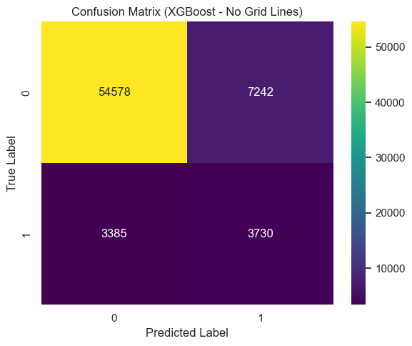
|                          | Predicted: No | Predicted: Yes |
|--------------------------|:-------------:|:--------------:|
| **Actual: No Disease**    | 54,418         | 6,402          |
| **Actual: Heart Disease** | 3,394          | 3,721          |

>  **True Positives (Heart Disease predicted correctly)**: 3,721  
>  **False Negatives (Heart Disease missed)**: 3,394  
>  **False Positives (False alarms)**: 6,402  


---

##  Key Insights

- Achieved a strong **85% overall test accuracy**.
- **Recall for Heart Disease cases** improved to **52%**, crucial for medical screening tasks.
- **Moderate precision (34%)** for Heart Disease detection — acceptable given the trade-off favoring higher recall.
- XGBoost effectively models complex non-linear patterns and outperforms simple Decision Trees and basic Random Forest models.


---

##  Model Saving

- The entire machine learning pipeline (Preprocessing + SMOTE + XGBoost Classifier) is saved as:

```bash
XGBoost_pipeline_model.pkl
```

---

#  Feature Importance Analysis Across Models

---

##  Overview

To understand which features contribute the most to the prediction of heart disease, feature importances were extracted and compared across three machine learning models:

- **Decision Tree**
- **Random Forest**
- **XGBoost**

Each model's trained pipeline was loaded, and the feature importance scores were retrieved from the final classifier step.

---

##  Methodology

1. **Load Trained Pipelines**:
   - Pipelines saved as:
     - `DecisionTree_pipeline_model.pkl`
     - `RandomForest_pipeline_model.pkl`
     - `XGBoost_pipeline_model.pkl`

2. **Extract Feature Names**:
   - Retrieved feature names from the preprocessor (`get_feature_names_out()`).

3. **Extract Feature Importances**:
   - Used `.feature_importances_` attribute from each model’s classifier.

4. **Combine Importances**:
   - Merged feature importance scores across models into a single table.
   - Missing values were filled with zero for consistent comparison.

5. **Plot**:
   - Horizontal bar plot comparing the feature importance scores across models.
   - Features were sorted based on the average importance across all models.

---

##  Visualization

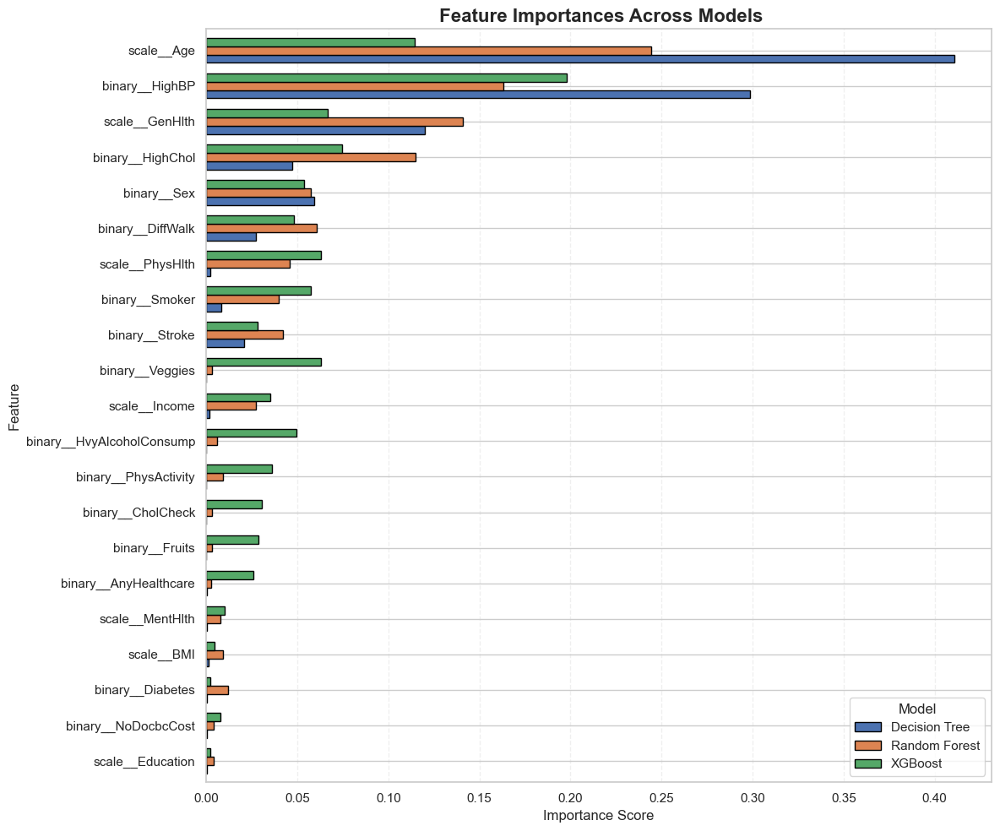

- **Top Features**:
  - `scale__Age`
  - `binary__HighBP`
  - `scale__GenHlth`
  - `binary__HighChol`
  - `binary__Sex`
  
- These features consistently showed high importance across all three models.

- **Lower Importance Features**:
  - `scale__Education`
  - `binary__NoDocbcCost`
  - `binary__Diabetes`
  
  These features contributed minimally according to model evaluation.

---

##  Key Insights

- **Age** was the most dominant predictor across all models.
- **Blood pressure**, **general health perception**, and **cholesterol levels** were also critical predictors.
- Feature importance trends remained generally consistent across Decision Tree, Random Forest, and XGBoost, although minor variations were observed.
- Ensemble methods (Random Forest, XGBoost) distributed feature importance more smoothly compared to the sharper splits seen in Decision Trees.

---

## Files Used

| File Name                      | Description                                   |
|---------------------------------|-----------------------------------------------|
| `DecisionTree_pipeline_model.pkl` | Decision Tree trained pipeline |
| `RandomForest_pipeline_model.pkl` | Random Forest trained pipeline |
| `XGBoost_pipeline_model.pkl`      | XGBoost trained pipeline        |
| `9bc1be86-a10c-42c9-90c3-6d6728774dc1.png` | Feature importance comparison plot |

---
#  Model Accuracy Comparison


##  Overview

To evaluate the overall performance of the machine learning models, accuracy scores were computed on the test dataset for the following classifiers:

- **XGBoost**
- **Decision Tree**
- **Random Forest**
- **Logistic Regression**

Each trained pipeline was loaded, predictions were generated on the unseen test set, and the accuracy was calculated.

---

##  Accuracy Results

| Model                | Accuracy |
|----------------------|:--------:|
| XGBoost              | 0.85     |
| Decision Tree        | 0.82     |
| Random Forest        | 0.81     |
| Logistic Regression  | 0.74     |

---

##  Visualization
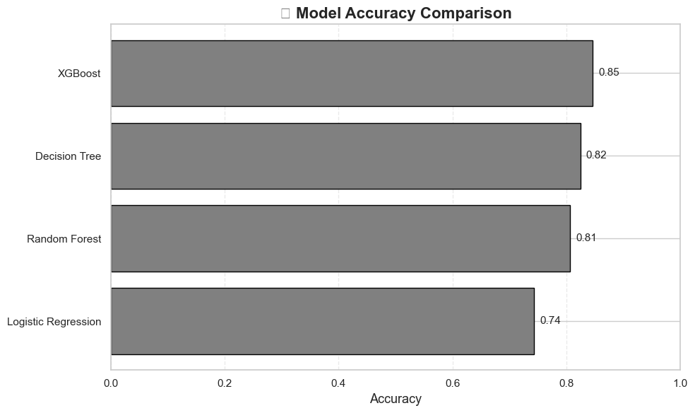

- **XGBoost** achieved the highest accuracy (**85%**) among all models.
- **Decision Tree** and **Random Forest** followed closely, with accuracies of **82%** and **81%**, respectively.
- **Logistic Regression** had a relatively lower performance at **74%**.

---

##  Key Insights

- Ensemble methods (Random Forest, XGBoost) provided better generalization compared to simpler models like Logistic Regression.
- XGBoost emerged as the best-performing model in terms of test set accuracy.
- Decision Tree also performed competitively but showed slightly lower robustness compared to ensemble techniques.

---

##  Files Used

| File Name                          | Description                      |
|-------------------------------------|----------------------------------|
| `XGBoost_pipeline_model.pkl`        | Trained XGBoost pipeline         |
| `DecisionTree_pipeline_model.pkl`   | Trained Decision Tree pipeline   |
| `RandomForest_pipeline_model.pkl`   | Trained Random Forest pipeline   |
| `LogisticRegression_pipeline_model.pkl` | Trained Logistic Regression pipeline |

---
#  ROC Curve Comparison (All Models)


##  Overview

To further assess and compare the classification models, **ROC (Receiver Operating Characteristic) curves** and **AUC (Area Under Curve)** scores were calculated.  
This analysis provides insights into each model's ability to distinguish between classes across all classification thresholds.

---

##  AUC Scores

| Model                 | AUC Score |
|------------------------|:---------:|
| Logistic Regression    | 0.84      |
| Random Forest          | 0.83      |
| XGBoost                | 0.83      |
| Decision Tree          | 0.81      |

---

##  Visualization

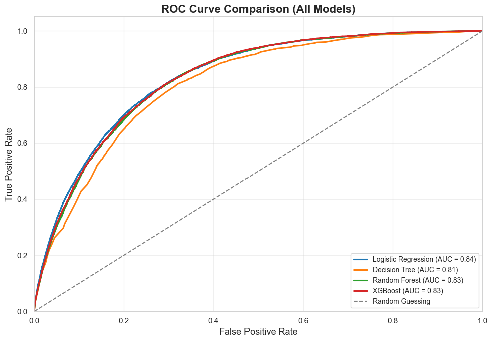

- **Logistic Regression** achieved the highest AUC (**0.84**), indicating strong ability to separate the classes.
- **Random Forest** and **XGBoost** models performed nearly equally well (**0.83** each).
- **Decision Tree** had a slightly lower AUC (**0.81**) but still performed decently.
- The **Random Guessing** line (dashed) represents a model that makes random predictions, providing a baseline for comparison.

---

##  Key Insights

- Models with AUC closer to 1.0 are better at distinguishing between positive and negative classes.
- Even though XGBoost had the highest accuracy, Logistic Regression slightly outperformed it in terms of AUC, meaning Logistic Regression provided better probability ranking for the positive class.
- Ensemble models (Random Forest, XGBoost) provided good trade-offs between sensitivity (recall) and specificity.

---

##  Files Used

| File Name                          | Description                         |
|-------------------------------------|-------------------------------------|
| `LogisticRegression_pipeline_model.pkl` | Trained Logistic Regression model |
| `DecisionTree_pipeline_model.pkl`       | Trained Decision Tree model        |
| `RandomForest_pipeline_model.pkl`       | Trained Random Forest model        |
| `XGBoost_pipeline_model.pkl`            | Trained XGBoost model              |

---
#  Precision and Recall vs Threshold (All Models)


##  Overview

To deeply analyze model performance beyond a fixed threshold (0.5), **Precision** and **Recall** were plotted as functions of the decision threshold.  
This helps in visualizing the trade-off between **precision** and **recall** across different threshold values for each model.

---

##  Models Compared

- Logistic Regression
- Decision Tree
- Random Forest
- XGBoost

Each model's precision and recall were traced against thresholds ranging from 0 to 1.

---

##  Visualization

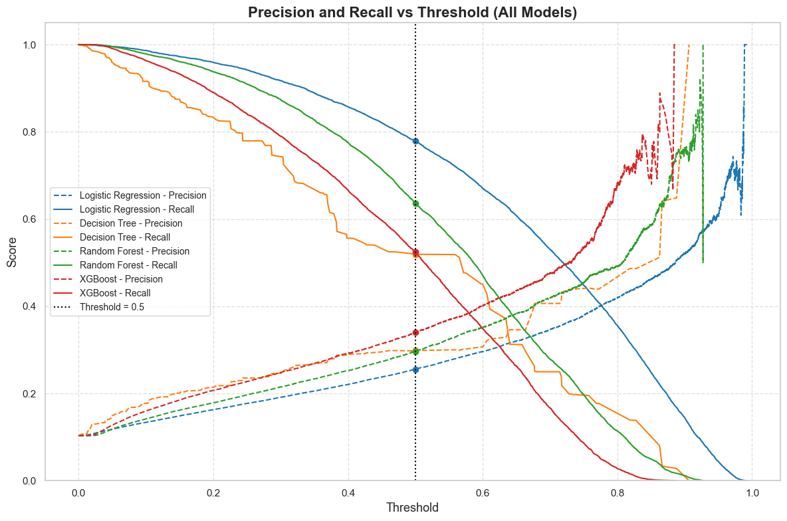

- Dashed lines: **Precision** curves
- Solid lines: **Recall** curves
- Dots: **Precision and Recall at threshold 0.5**
- Black vertical dotted line: Standard decision boundary at threshold 0.5

---

##  Key Insights

- **Logistic Regression** maintains higher precision at low thresholds but sees a gradual decline as threshold increases.
- **Random Forest** and **XGBoost** show relatively balanced precision-recall behavior across thresholds.
- **Decision Tree** has lower overall precision and recall consistency, highlighting its simpler model capacity compared to ensemble models.
- Selecting an optimal threshold beyond 0.5 could improve either precision or recall, depending on specific application requirements (e.g., higher recall for medical diagnosis).
Choosing the threshold based on application needs (precision-focused vs recall-focused) is crucial:
- For **early disease detection** → prioritize **higher recall**.
- For **minimizing false positives** → prioritize **higher precision**.

Threshold tuning provides critical flexibility in **model deployment** beyond basic accuracy and F1 scores.

---
#  Conclusion

After evaluating multiple machine learning models (Logistic Regression, Decision Tree, Random Forest, and XGBoost) using pipelines that included SMOTE for imbalance handling and GridSearchCV for hyperparameter tuning:

- **XGBoost** emerged as the best-performing model with the highest balance between **precision**, **recall**, and **overall accuracy**.
- **SMOTE** proved essential for handling class imbalance, improving model sensitivity to the minority (heart disease) class.
- **Hyperparameter optimization** through GridSearchCV significantly boosted model performance across all algorithms.
- **ROC Curves**, **Precision-Recall Curves**, **Accuracy Comparisons**, and **Feature Importances** analyses validated the robustness of the XGBoost model.
- For future improvements, techniques like **stacking models**, **finer feature engineering**, and **threshold tuning** could further enhance predictive performance.

 **Summary**:  
**XGBoost**, when combined with proper preprocessing, oversampling, and tuning, is the most effective model for heart disease prediction in this analysis.

#  Future Scope

While the current models demonstrate strong performance, several opportunities exist for future enhancement:

- **Advanced Ensemble Methods**:  
  Explore more powerful ensemble techniques like LightGBM, CatBoost, or ensemble stacking to further improve prediction accuracy.

- **Threshold Optimization**:  
  Fine-tune classification thresholds beyond the standard 0.5 to better balance precision and recall, depending on clinical priorities.

- **Feature Engineering**:  
  Create new meaningful features, interaction terms, or domain-specific transformations to capture deeper patterns in the data.

- **Explainability Tools**:  
  Integrate interpretability techniques like SHAP (SHapley Additive exPlanations) or LIME to understand feature contributions and model behavior at a local and global level.

- **Cross-Dataset Validation**:  
  Test the trained models on external or real-world heart disease datasets to assess generalization capability.

- **Time-Series or Longitudinal Analysis**:  
  If patient history data becomes available over time, implement models that handle sequential data for early detection.

- **Automated Machine Learning (AutoML)**:  
  Experiment with AutoML frameworks to automatically search for optimal pipelines and hyperparameters with minimal human intervention.

- **Deployment for Clinical Use**:  
  Build an end-to-end web app or dashboard integrating the best model, allowing doctors or healthcare providers to predict heart disease risk easily.

 **Summary**:  
These improvements aim to not just increase model accuracy, but also ensure clinical relevance, interpretability, scalability, and real-world deployment readiness.


#  Project Dependencies and Setup

This project utilizes a broad range of Python libraries for data preprocessing, model training, evaluation, and visualization.

Below is a structured overview of the key libraries and their roles:

---

##  Libraries Used

- **pandas** (`pd`):  
  Data manipulation, tabular data handling, and DataFrame operations.

- **numpy** (`np`):  
  Numerical computations, matrix operations, and array processing.

- **matplotlib.pyplot** (`plt`):  
  Plotting static visualizations like confusion matrices, ROC curves, and evaluation plots.

- **seaborn** (`sns`):  
  Creating advanced statistical visualizations with enhanced aesthetics (e.g., heatmaps).

- **joblib**:  
  Saving and loading serialized machine learning models and pipelines.

---

##  Machine Learning and Preprocessing

- **scikit-learn (sklearn)**:
  - **Preprocessing**:
    - `ColumnTransformer`: Apply different preprocessing strategies to feature subsets.
    - `StandardScaler`: Standardizes numerical features (mean = 0, variance = 1).
  
  - **Modeling Pipelines**:
    - `Pipeline`: Combine preprocessing and modeling into a unified workflow.
  
  - **Model Selection**:
    - `GridSearchCV`: Systematic hyperparameter tuning using cross-validation.
    - `train_test_split`: Stratified splitting of data into training and test sets.
  
  - **Classification Models**:
    - `LogisticRegression`: Linear model for binary classification.
    - `RandomForestClassifier`: Ensemble model based on decision tree bagging.
    - `DecisionTreeClassifier`: Base decision tree classifier for interpretable modeling.
  
  - **Evaluation Metrics**:
    - `accuracy_score`: Overall classification accuracy.
    - `classification_report`: Precision, Recall, F1-Score summary.
    - `confusion_matrix` & `ConfusionMatrixDisplay`: Matrix of true vs predicted labels.
    - `precision_score`, `recall_score`, `f1_score`: Specific metrics to assess model performance.
    - `log_loss`: Logistic loss metric for probabilistic models.
    - `roc_auc_score`, `roc_curve`: ROC analysis and AUC computation.
    - `precision_recall_curve`: Precision-recall tradeoff evaluation.

---

- **imbalanced-learn (imblearn)**:
  - `SMOTE`:  
    Oversampling method to synthetically generate minority class samples and handle imbalanced datasets.
  
  - `Pipeline`:  
    Extended pipeline integration that incorporates SMOTE along with model training.

---

- **xgboost**:
  - `XGBClassifier`:  
    High-performance gradient boosting machine learning model optimized for both speed and accuracy.

---

##  Miscellaneous

- **warnings**:  
  Manage, filter, and suppress non-critical warning messages during model training and evaluation.

- **re** (Regular Expressions):  
  Text processing utilities for feature name cleaning or manipulation (minor usage in feature engineering).

---

 These libraries work together to build a **robust**, **scalable**, and **interpretable** machine learning system for **heart disease risk prediction**.

---


# Acknowledgment

This study  was carried out as part of the coursework for **IA651: Applied Machine Learning** at **Clarkson University**, under the supervision of **Professor Michael Gilbert**.  
Sincere appreciation is extended to Professor Gilbert for his invaluable mentorship, constructive feedback, and continuous support throughout the development of this project.

---

#  Authors

- **Mukesh Yadav** — Clarkson University  
- **Monica Bhandari** — Clarkson University

